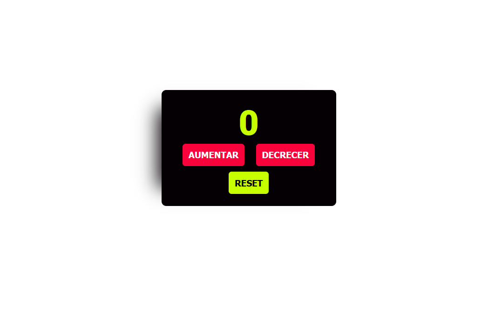

# 🖱️ Contador de click

Un contador con botones de aumentar, decrecer y resetear uno de mis primeros proyectos tomados de YouTube.

---

## 🚀 Características

- ⬆️ Aumentar, suma la cantidad de veces que se presiona el botón.

* ⬇️ Decrecer, resta la cantidad de veces que es presionado el botón.

- ⭕ Reset, vuelve el contador a 0.

---

## 🛠️ Construido con

##   

---

## 🌐 Live demo

🧷 [Ver Contador](https://cool-platypus-d37e19.netlify.app/)

---

## 🖼️ Vista previa

Un print de pantalla del proyecto:


---

## 📁 Estructura del proyecto

```
COUNTER/
│
├── index.html # Main HTML file
├── image-1.png
└── css
    │__ style.css
|__ js
    |__ app.js
```
